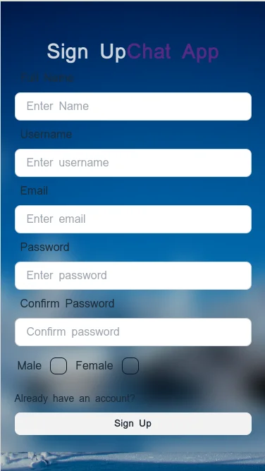
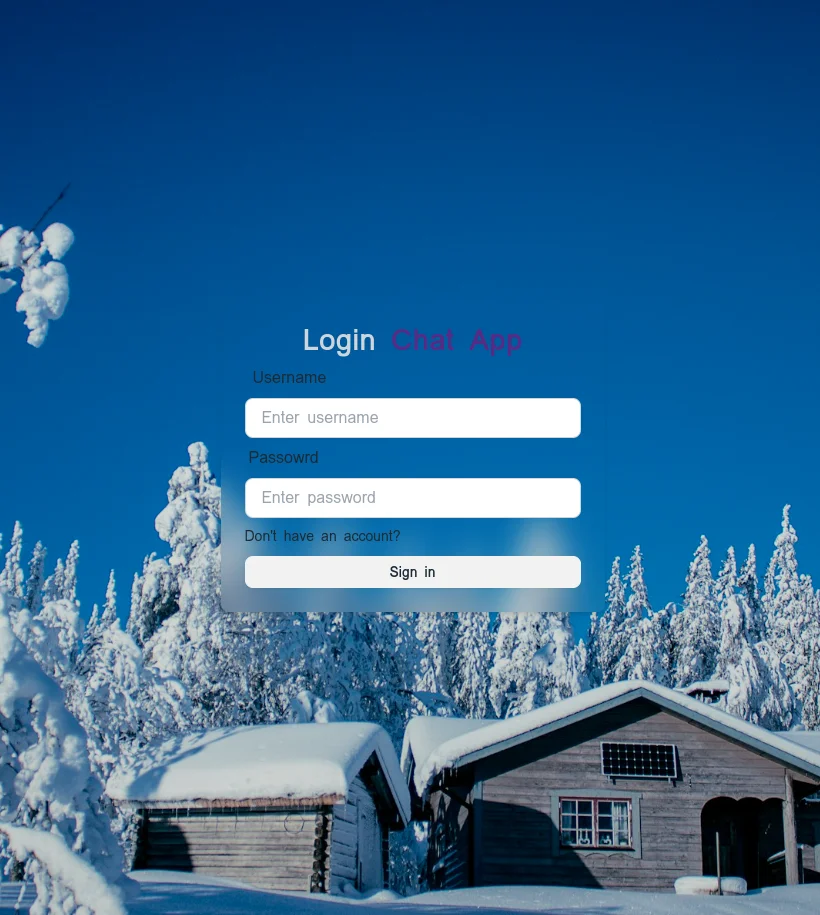
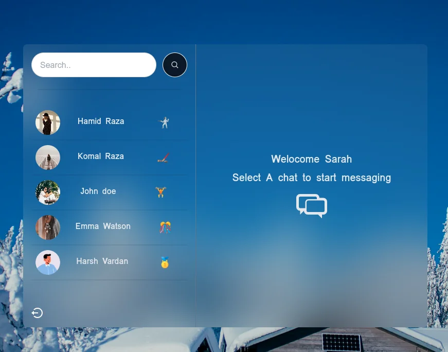
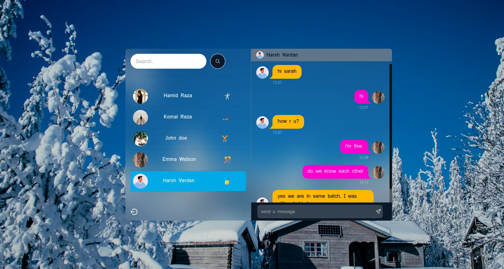
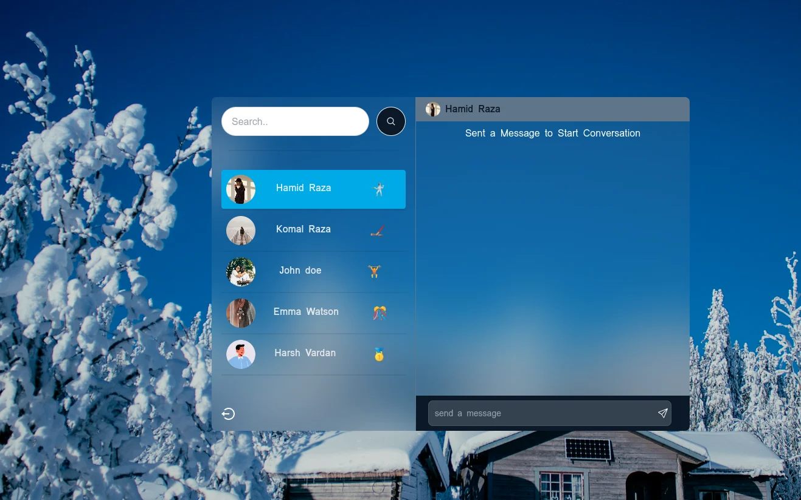
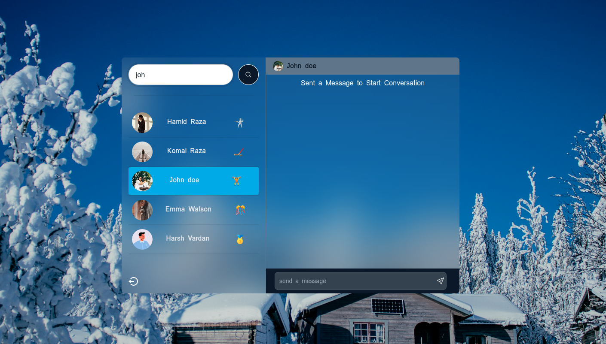
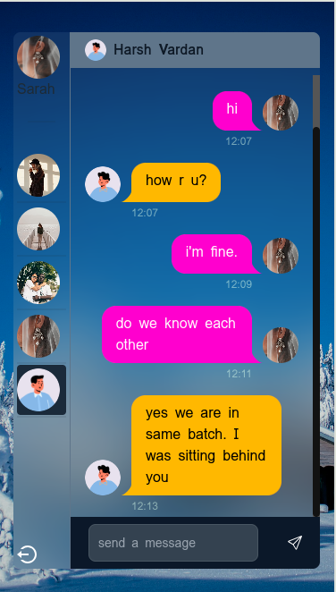

# Chat App

A chat application built with modern web technologies, including React.js, Node.js, Express.js, and MongoDB. This app allows users to communicate in real-time, manage their conversations, and connect with other users effortlessly.

## Technologies Used

- **Frontend**: React.js, DaisyUI, Tailwind CSS
- **Backend**: Node.js, Express.js
- **Database**: MongoDB, Mongoose for Database Schema
- **Real-time Communication**: Socket.io

## Features

- **JWT Authentication**: Secure sign-up and login mechanism
- **User Management**: Display all registered users
- **Direct Messaging**: Start conversations by selecting users
- **Online Status**: See which logged-in users are currently online
- **Real-time Messaging**: Send and receive messages in real-time
- **Chat History**: Store conversations in the database and retrieve old chats
- **User Search**: Search for any user in the application
- **Responsive UI**: Designed to work seamlessly on various devices using React.js and Tailwind CSS

## Project Images









### Responsive Images





## Demo Links

- [Live Demo Link](https://chat-app-njh0.onrender.com/login)
- [Demo Video Link](your_demo_video_link)

## Getting Started

Follow the steps below to get a local copy up and running on your machine for development and testing purposes.

### Prerequisites

Make sure you have the following installed:

- Node.js
- MongoDB

### Installation

1. Clone the repository:

   ```bash
   git clone https://github.com/komal-raza/Chat-app.git
   cd chat-app


2. Install server dependencies:
   
    ```bash
    cd server
    npm install

3. Install client dependencies:
 
    ```bash
    cd client
    npm install

4. Set up environment variables:

Ensure your MongoDB connection URI is added to your environment variables, as well as any required JWT secrets.

5. Start the server:

   ```bash
    cd server
    npm start

6. Start the client:
7. 
   ```bash
    cd client
    npm start

8. Usage
   
    Go to http://localhost:3000 on your browser

    Sign up or log in to see the chat interface

    Start chatting with online users!
